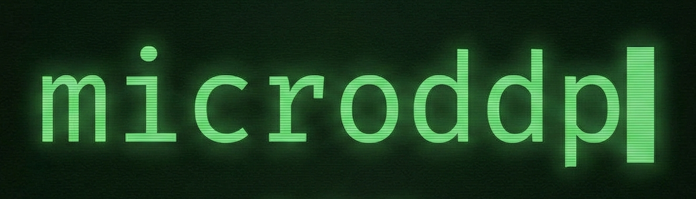

# microddp



## Quick Start

```bash
uv run torchrun --nproc-per-node=4 src/main.py
```

## Architecture

- **`comms.py`**: Distributed communication primitives (all-reduce)
- **`model.py`**: Full MLP model (replicated on each rank)
- **`schedule.py`**: Data parallelism schedules (naive, DDP)
- **`main.py`**: Training entry point

## Data Parallelism Schedules

- `naive_data_parallel_step`: Manual gradient averaging
- `ddp_step`: DistributedDataParallel with all-reduce

See [kiankyars.github.io/microddp/](https://kiankyars.github.io/microddp/) for detailed explanations.

## Repo Structure

```text
├── CONTRIBUTING.md
├── README.md
├── docs
├── my_work
│   ├── step1_manual.py
│   ├── step2_comms.py
│   ├── step3_allreduce.py
│   ├── step4_model.py
│   ├── step5_main.py
│   └── step6_ddp.py
├── pyproject.toml
├── src
│   ├── comms.py
│   ├── main.py
│   ├── manual.py
│   ├── model.py
│   ├── monolith.py
│   └── schedule.py
└── uv.lock
```

## Acknowledgements

Simon Boehm, TE Hao

