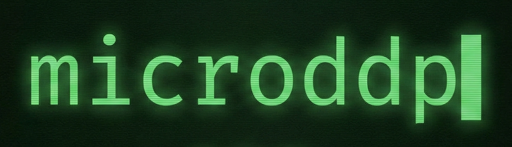

# microddp



## Quick Start

```bash
uv run torchrun --nproc-per-node=4 src/main.py
```

## Architecture

- **`comms.py`**: Distributed communication primitives (all-reduce, barriers, broadcast, scatter/gather)
- **`model.py`**: Full MLP model (replicated on each rank)
- **`schedule.py`**: Data parallelism schedules (naive, DDP with bucketing)
- **`main.py`**: Training entry point
- **`bucketing.py`**: Gradient bucketing for efficient communication

## Data Parallelism Schedules

- `naive_data_parallel_step`: Manual gradient averaging (baseline)
- `ddp_step`: DistributedDataParallel with gradient hooks
- `register_ddp_hooks`: Automatic gradient synchronization with optional bucketing

## Repo Structure

```text
├── CONTRIBUTING.md
├── README.md
├── docs
├── my_work
│   ├── step1_manual.py
│   ├── step2_comms.py
│   ├── step3_allreduce.py
│   ├── step4_ring_allreduce.py
│   ├── step5_main.py
│   └── step6_ddp.py
├── pyproject.toml
├── src
│   ├── allreduce.py      # All-reduce algorithms from scratch
│   ├── baseline.py       # Single GPU baseline
│   ├── bucketing.py      # Gradient bucketing implementation
│   ├── comms.py          # Communication primitives
│   ├── hooks.py          # Hook execution demonstration
│   ├── main.py           # Training entry point
│   ├── manual.py         # Manual 2-GPU example
│   ├── model.py          # MLP model definition
│   ├── performance.py    # Performance analysis tools
│   └── schedule.py       # DDP schedules
└── uv.lock
```

## Acknowledgments

- Umar Jamil for the figures