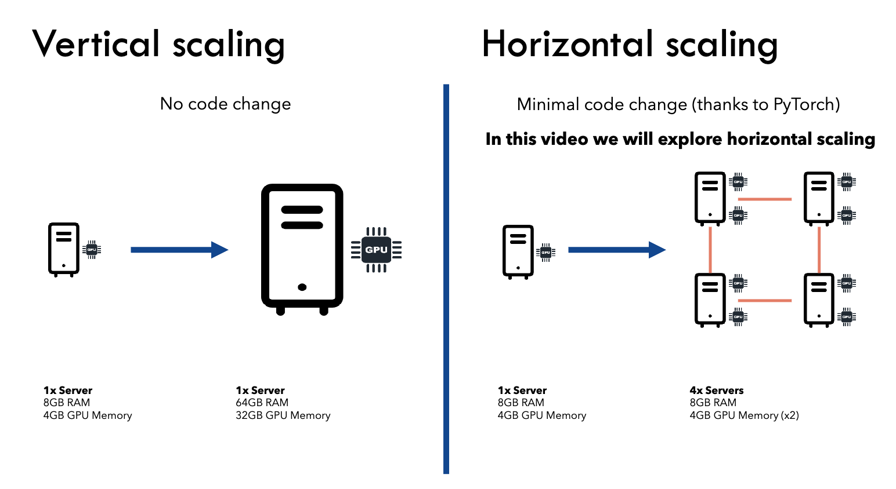
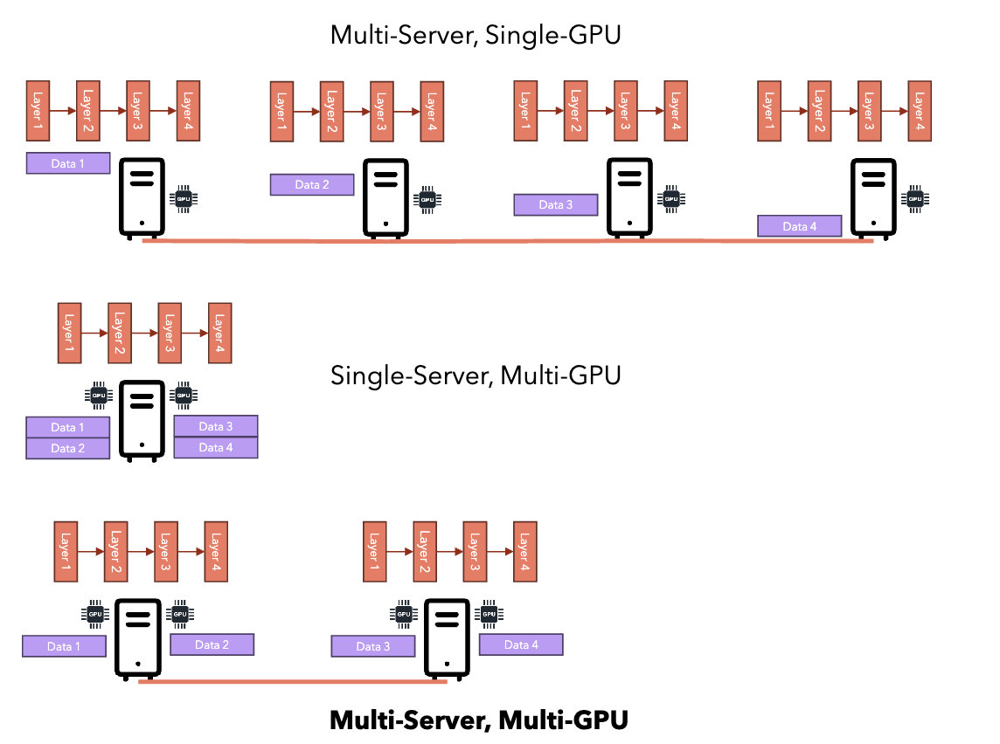
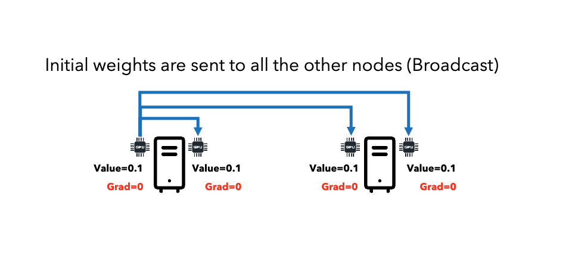
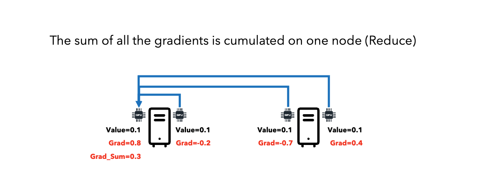
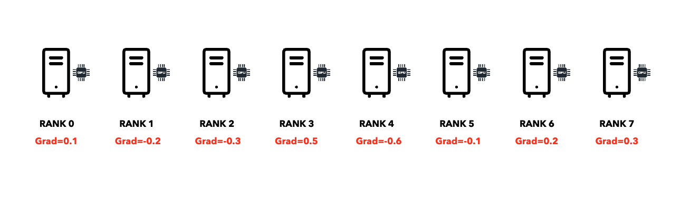
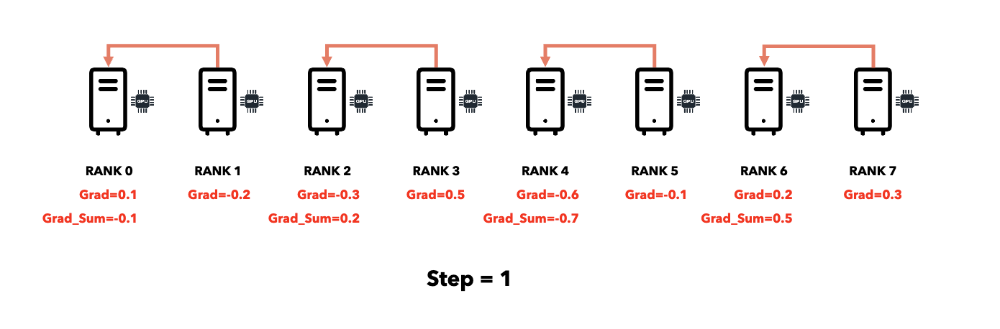
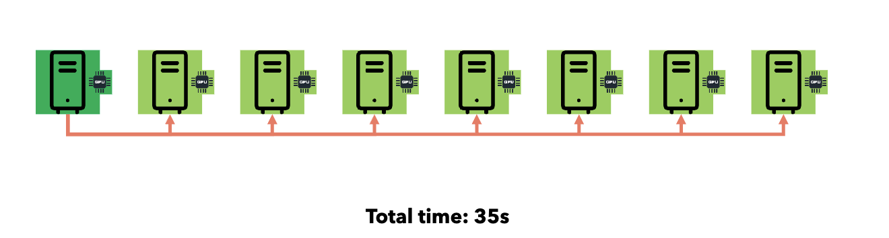
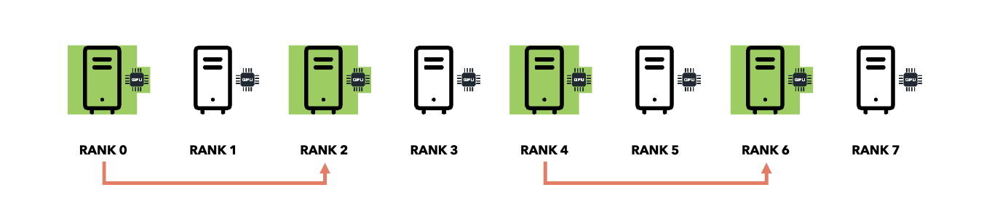
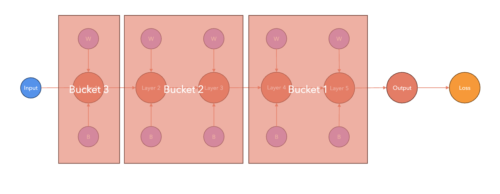

# Introduction to Distributed Data Parallelism

## Why Distributed Training?

Training large models on a single GPU faces three challenges:

1. **Model too large**: May not fit in GPU memory.
2. **Batch size**: OOM errors.
3. **Time**: Can take years on huge datasets.

- Scale horizontally (multiple GPUs/servers) or vertically (bigger GPU).

## Data Parallel vs Model Parallel

### Data Parallelism

- Model fits in a single GPU.

### Model Parallelism

- Model too large for single GPU.

### DataParallel vs DistributedDataParallel

| Aspect                       | DataParallel (DP)                                     | DistributedDataParallel (DDP)                                           |
|------------------------------|------------------------------------------------------|-------------------------------------------------------------------------|
| Process Model                | Single-process, multi-threaded                       | Multi-process, each process controls one device (GPU)                   |
| Machine Support              | Only works on a single machine                       | Supports both single-machine and multi-machine setups                   |
| Model Replication            | Replicates model across devices within one process (overhead)   | Each process gets its own model replica, handles a subset of the data   |
| Communication                | Via threads, subject to Python GIL and I/O overhead | Uses collectives (e.g. all-reduce) outside Python GIL                   |
| Performance                  | Generally slower, even single-machine                | Much faster, highly scalable; preferred for all single/multi-node cases |

## Distributed Data Parallel (DDP) Workflow

1. **Broadcast**: Initialize model weights on one node, send to all nodes.

   
   

2. **Forward/Backward**: Each node trains on different data chunk, computes local gradients.

   

3. **All-Reduce**: Sum gradients across all nodes, distribute result to all nodes.

   
   

4. **Update**: Each node updates its model using the averaged gradients.

   

## Communication Primitives

### Reduce (All → One)

### Broadcast (One → All)

**Point-to-Point**:

- Time: O(n) where n = number of receivers.

**Naive Collective Communication**:

**Smart Collective Communication**:

## PyTorch DDP Optimizations

### Computation-Communication Overlap

- Gradient hooks trigger all-reduce immediately when each gradient is ready.
- Communication overlaps with gradient computation, reducing idle time.

### Bucketing

## Failover and Checkpointing

- Rank 0 saves model checkpoints to avoid conflicts.

