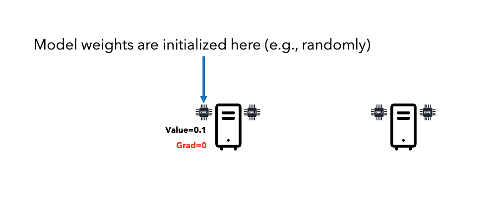
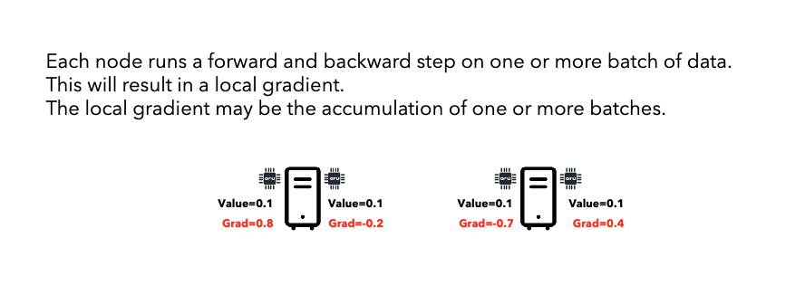
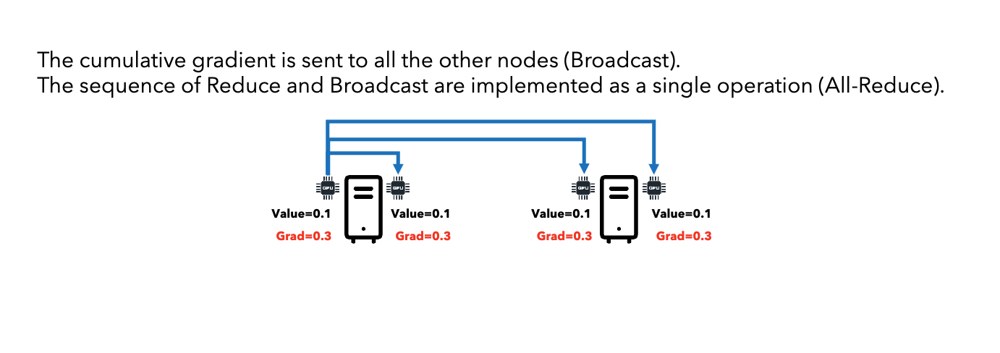
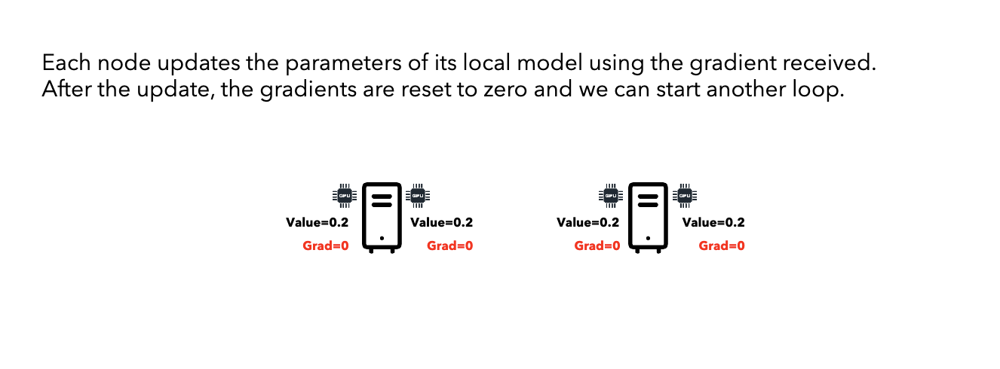
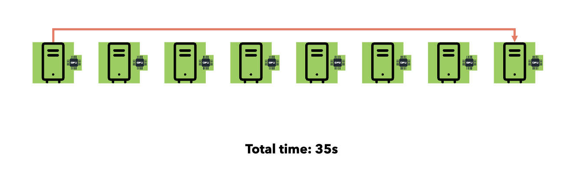
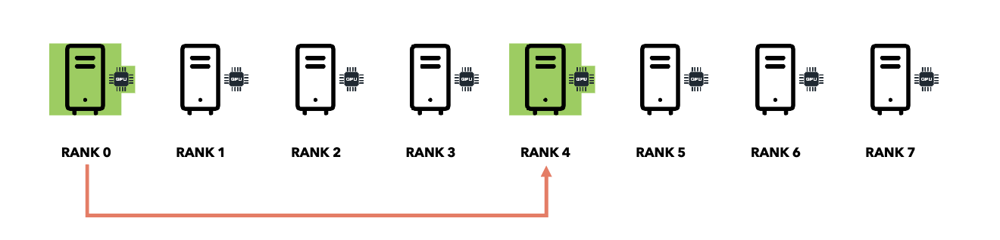
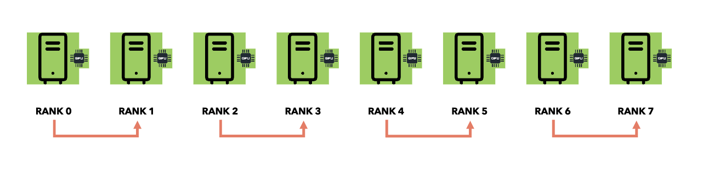
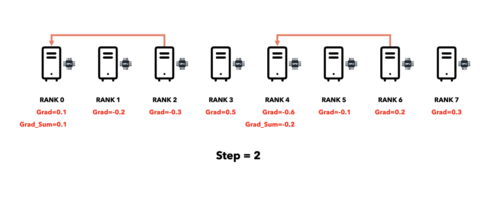
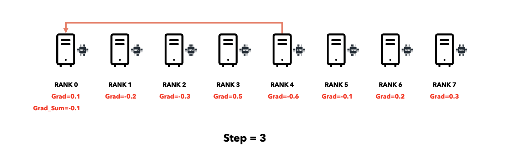

# Introduction to Distributed Data Parallelism

## Why Distributed Training?

Training large models on a single GPU faces three challenges:

1. **Model too large**: May not fit in GPU memory.
2. **Batch size**: Limited by GPU memory, leading to OOM errors.
3. **Time**: Can take years on huge datasets.

We can either scale horizontally (multiple GPUs/servers) or vertically (bigger GPU).

All formats are supported by torchrun.

## Data Parallel vs Model Parallel

### Data Parallelism

- **When**: Model fits in a single GPU.
- **How**: Replicate model across GPUs, split data across GPUs.
- **Each GPU**: Has full model, processes different data chunk.
- **Synchronization**: Average gradients across all GPUs.

### Model Parallelism

- **When**: Model too large for single GPU.
- **How**: Split model layers across GPUs.
- **Each GPU**: Has part of model, processes same data.
- **Synchronization**: Pass activations between GPUs.

### DataParallel vs DistributedDataParallel

| Aspect                       | DataParallel (DP)                                     | DistributedDataParallel (DDP)                                           |
|------------------------------|------------------------------------------------------|-------------------------------------------------------------------------|
| Process Model                | Single-process, multi-threaded                       | Multi-process, each process controls one device (GPU)                   |
| Machine Support              | Only works on a single machine                       | Supports both single-machine and multi-machine setups                   |
| Model Replication            | Replicates model across devices within one process (overhead)   | Each process gets its own model replica, handles a subset of the data   |
| Communication                | Via threads, subject to Python GIL and I/O overhead | Uses collectives (e.g. all-reduce) outside Python GIL                   |
| Performance                  | Generally slower, even single-machine                | Much faster, highly scalable; preferred for all single/multi-node cases |

## Distributed Data Parallel (DDP) Workflow

1. **Broadcast**: Initialize model weights on one node, send to all nodes.
   
   

2. **Forward/Backward**: Each node trains on different data chunk, computes local gradients.
   

3. **All-Reduce**: Sum gradients across all nodes, distribute result to all nodes.
   
   

4. **Update**: Each node updates its model using the averaged gradients.
   

## Communication Primitives

### Point-to-Point vs Collective Communication

**Point-to-Point**:
- Time: O(n) where n = number of receivers.
- 

**Collective Communication**:
- Time: O(log n) using divide-and-conquer.
- 

### Broadcast (One → All)

- **Use**: Send initial weights to all nodes.
- **Algorithm**: Divide-and-conquer (binary tree).
- **Complexity**: O(log n) steps.
- **Example**: Rank 0 sends to rank 1, then ranks 0-1 send to ranks 2-3, etc.

### Reduce (All → One)

- **Use**: Sum gradients from all nodes to one node.
- **Algorithm**: Divide-and-conquer (reverse binary tree).
- **Complexity**: O(log n) steps.
- **Example**: Ranks 0-1 reduce to rank 0, ranks 2-3 reduce to rank 2, then rank 2 sends to rank 0.

### All-Reduce (All → All)

- **Use**: Sum gradients and distribute result to all nodes (used in DDP).
- **Algorithm**: Optimized version of Reduce + Broadcast.
- **Complexity**: O(log n) or O(n) depending on algorithm (ring all-reduce is O(n) but bandwidth-optimal).

## PyTorch DDP Optimizations

### Computation-Communication Overlap

- **Problem**: GPUs idle during gradient communication.
- **Solution**: Communicate gradients as soon as they're computed during backward pass.
- **How**: Gradient hooks trigger all-reduce immediately when each gradient is ready.
- **Result**: Communication overlaps with gradient computation, reducing idle time.

### Bucketing

- **Problem**: Many small gradient messages = high communication overhead.
- **Solution**: Group gradients into buckets (typically 25MB).
- **How**: Gradients packed into buckets, all-reduced together.
- **Result**: Fewer messages, better bandwidth utilization.

## Key Concepts

- **RANK**: Globally unique ID for each GPU/node in the cluster.
- **LOCAL_RANK**: ID of GPU on the local machine (0, 1, 2, 3...).
- **WORLD_SIZE**: Total number of GPUs/nodes.
- **Process Group**: Collection of processes that can communicate.

## Failover and Checkpointing

- **Problem**: Node crashes can lose all training progress.
- **Solution**: Save checkpoints to shared storage periodically.
- **Best Practice**: Only rank 0 saves checkpoints to avoid conflicts.
- **Recovery**: Resume training from last checkpoint after crash.

